# Building 86-DOS 0.11
This is a guide on building 86-DOS 0.11 from scratch, using the Cromemco Disk Operating System (CDOS) and SCP's 8086 Cross Assembler (AMS86).

## Requirements

### Hardware
1.  A [Cromemco Z-2D machine](https://wikipedia.org/wiki/Cromemco_Z-2#Cromemco_Z-2D) with four 8" drives*.
2.  An [SCP 8086 S-100 machine](https://archive.org/details/byte-magazine-1979-11/page/n168/mode/1up) with the [Cromemco 4FDC](https://wikipedia.org/wiki/Cromemco_4FDC) disk controller and four 8" drives**.

*\*[Greg Sydney-Smith's fork of the Z80 simulator from z80pack](https://www.sydneysmith.com/wordpress/run-cdos/) can be used instead of physical hardware.*<br>
*\*\*[Peter Schorn's fork of the AltairZ80 simulator](https://schorn.ch/altair_2.php) can be used instead of physical hardware.*


### Software
1.  [An 8" SSSD CDOS disk](./Disk%20Images/Cromemco%20CDOS%20with%20Build%20Tools.img) containing:
    1.  [The Cromemco Disk Operating System (CDOS)](https://wikipedia.org/wiki/Cromemco_DOS).
    2.  [SCP's 8086 Cross Assembler (ASM86)](./CPM%20Tools/README.md#asm86).
    3.  [My DOSGEN program](./CPM%20Tools/README.md#dosgen).
2.  An [8" SSSD CDOS disk containing the 86-DOS 0.11 source code](./Disk%20Images/86-DOS%200.11%20Source%20Code.img).
3.  An earlier version of 86-DOS or [an existing copy of 86-DOS 0.11](./Disk%20Images/Scratch%20LARGECRO%2086-DOS.img), with <code>LARGECRO</code> drive config*.

*\*Any version of 86-DOS 0.x (including 0.11) will do. The disk controller must be Cromemco 4FDC and the drive configuration must be <code>LARGECRO</code>. To create a bootable copy of 86-DOS 0.11 yourself from scratch, see [The Chicken and Egg Problem :: The First Egg](#the-first-egg).*

## Steps
1.  Power on the Z-2D machine and boot the CDOS disk.

    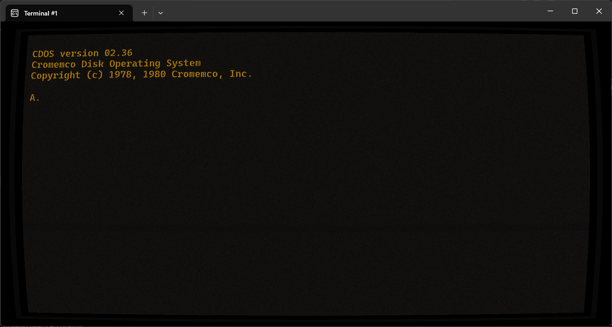

2.  Insert the 86-DOS source code disk in drive B.

    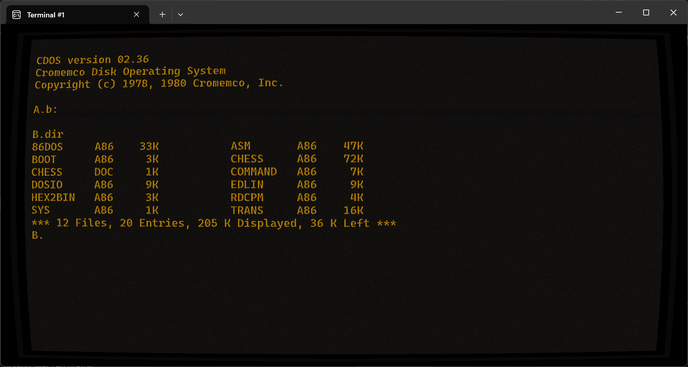

3.  Insert a blank formatted 8" SSSD disk in drive C.
4.  For each source (.A86) file on drive B:
    1.  Assemble to .HEX object by running <code>ASM86 \<name\>.BCZ</code>.

    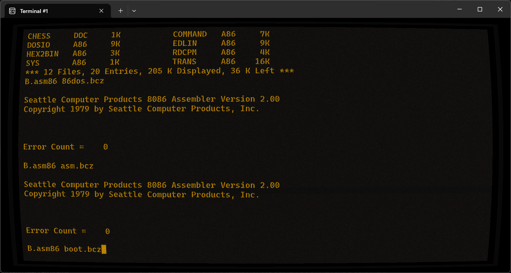

5.  Copy <code>CHESS.DOC</code> from drive B to drive C.

    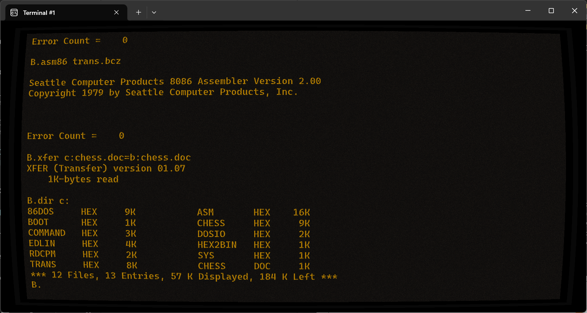

6.  Power on the 8086 S-100 machine and boot the earlier version of 86-DOS.

    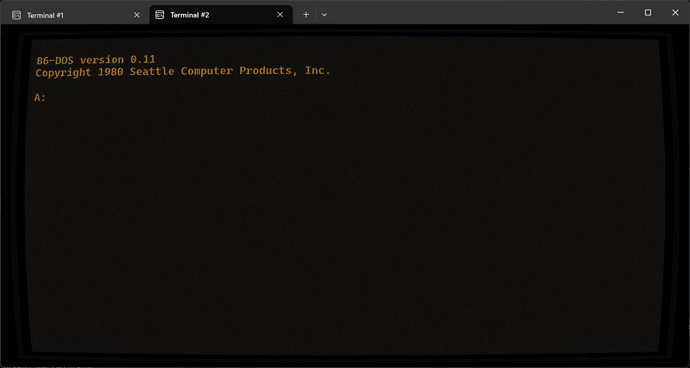

7.  Remove the disk in drive C of the Z-2D machine and insert it into drive C of the S-100 machine.
8.  Insert a blank formatted 8" SSSD disk into drive B.
9.  For each .HEX file on drive C (except for <code>86DOS.HEX</code>, <code>BOOT.HEX</code> and <code>DOSIO.HEX</code>):
    1.  Run <code>RDCPM C:\<name\>.HEX A:</code>
    2.  Run <code>HEX2BIN \<name\></code>

    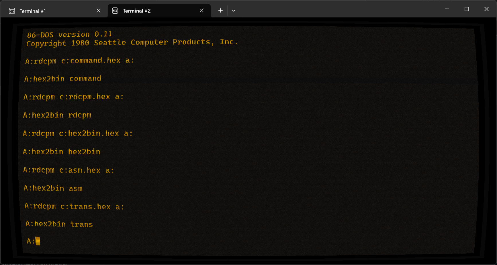

10. Run <code>RDCPM C:CHESS.DOC A:</code>.

    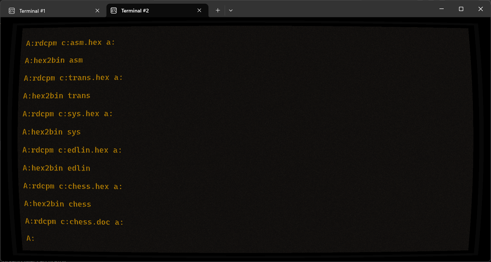

11. Run <code>EDLIN CHESS.DOC</code> and exit with the command <code>E</code> (to remove extra bytes at the end of <code>CHESS.DOC</code>).

    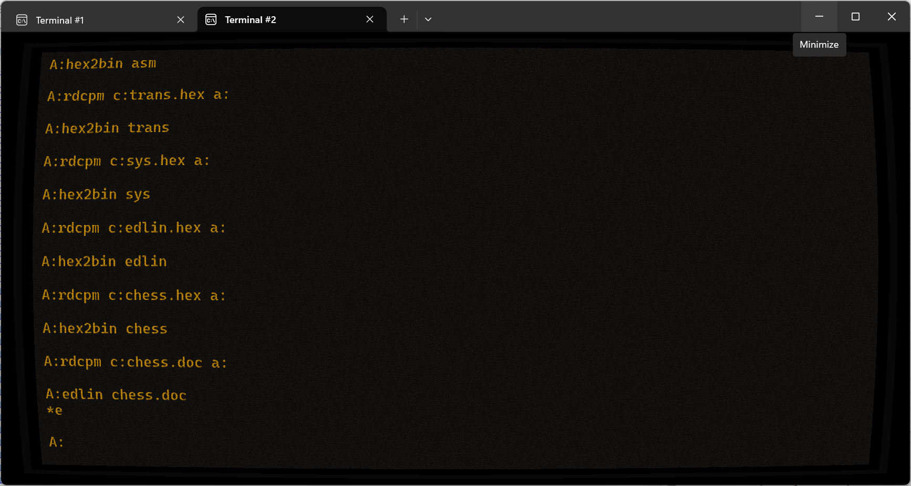

12. Run <code>ERASE ????????.HEX</code> (to delete all .HEX files).

    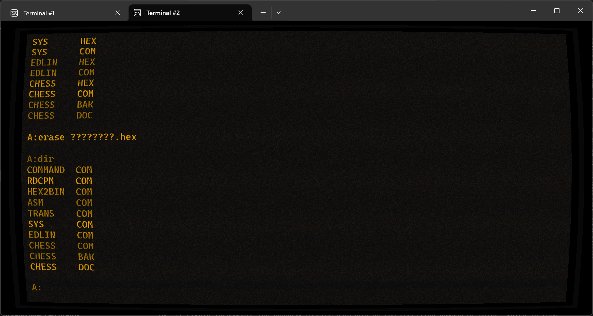

13. Run <code>ERASE ????????.BAK</code> (to delete all .BAK files).

    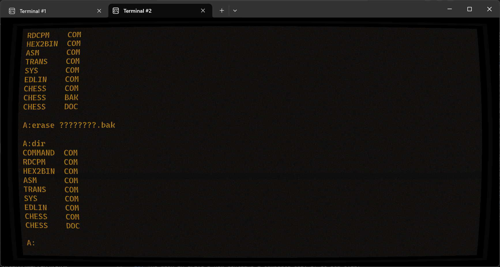

14. Run <code>CLEAR B:</code> and type <code>Y</code> (to put a filesystem on drive B).

    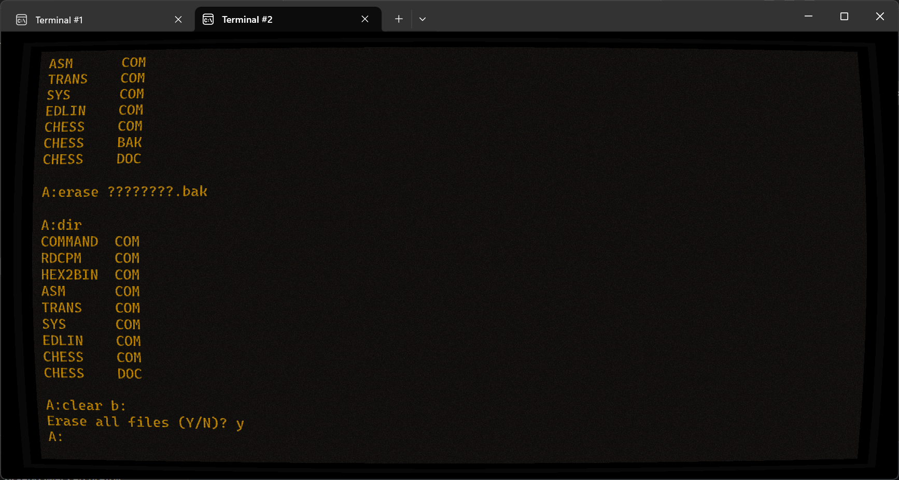

15. Copy all files from drive A to drive B (to create a "fresh" and "clean" disk).

    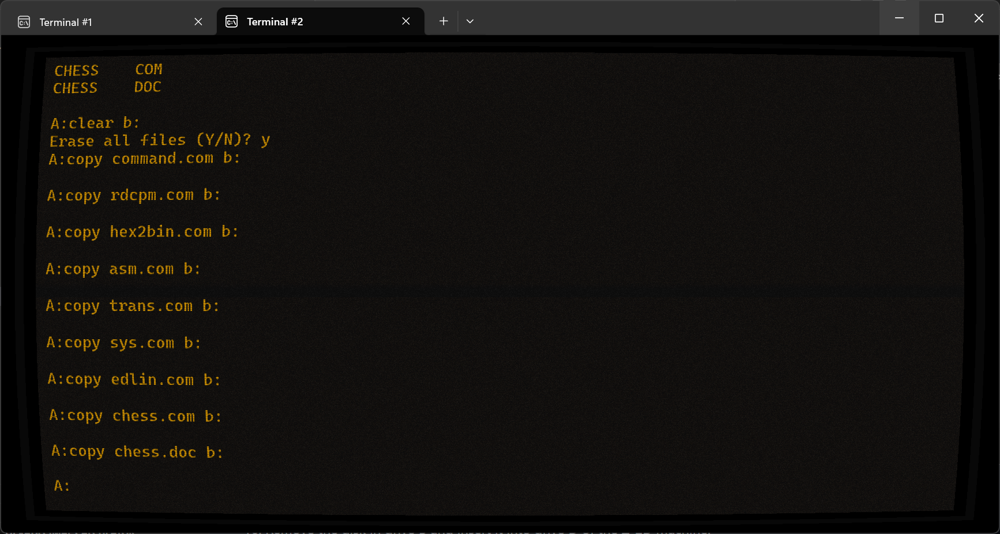

16. Remove the disk in drive B and insert it into drive D of the Z-2D machine.
17. Remove the disk in drive C and insert it into drive C of the Z-2D machine.
18. Go back to the Z-2D machine and change to drive C.

    

19. For <code>86DOS</code>, <code>BOOT</code> and <code>DOSIO</code>:
    1.  Run <code>DEBUG \<name\>.HEX</code>.
    2.  Quit <code>DEBUG</code> and dump the correct number of pages by running <code>SAVE \<name\>.COM \<num-pages\></code>. The number of pages is given by ⌈(<code>NEXT</code> - 0x100) ÷ 0x100⌉.

    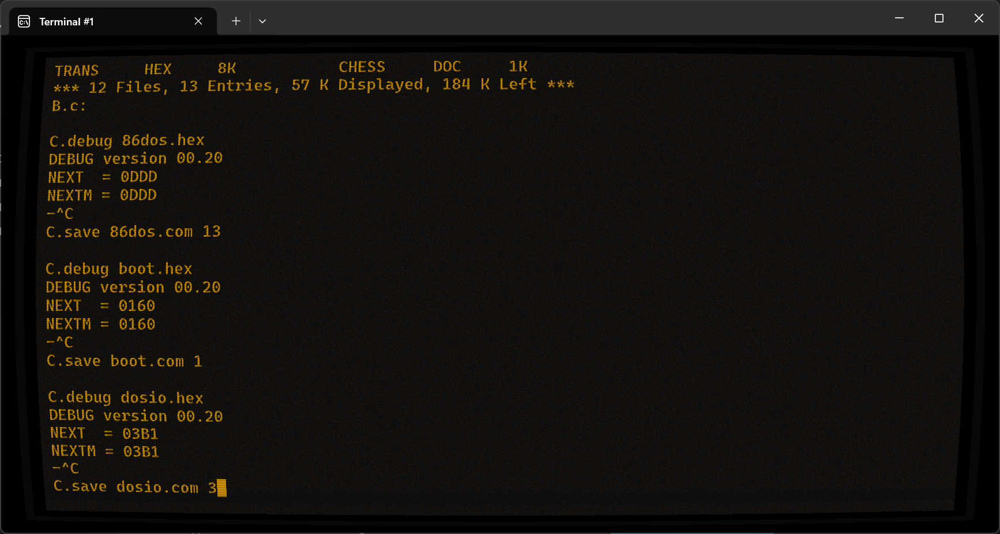

20. Run <code>DOSGEN D:</code>.

    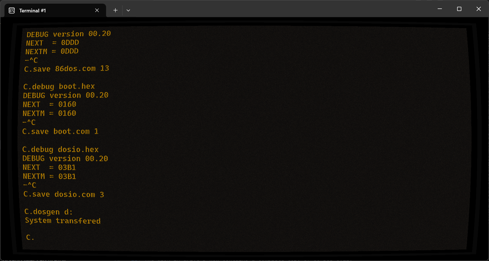

21. The disk in drive D now contains a complete copy of 86-DOS 0.11.

### Source of Details
If you examine the steps above, you'll notice that the disk containing the .HEX files is to be inserted into drive C of the SCP S-100 machine. Clearly, inserting the disk into any drive would work just as well. So, why did I specifically mention drive C? Well, because that's the drive Paterson used. Please refer to [Analysis of Uninitialized Data](#analysis-of-uninitialized-data) for further details.

## The Chicken and Egg Problem
In order to create a working copy of 86-DOS 0.11 from scratch, we need an earlier version of 86-DOS. However, we don't have that. Of course, we could simply use the original 0.11 distribution disk, but then we face a problem: How was that distribution disk made in the first place? Maybe with a copy of 86-DOS 0.10? But then this leads to another question: How was 86-DOS 0.10 built?

You see, to build 86-DOS, you need 86-DOS, and to get 86-DOS, you need to build 86-DOS... so how was the very first copy of 86-DOS built?

### The First Egg
Now, I'll guide you through creating a minimum build of 86-DOS 0.11 without the need of another copy of 86-DOS. I call this the first "egg".

#### Requirements
*Same as [Building 86-DOS 0.11 :: Requirements](#requirements).*

> [!IMPORTANT]
> You will need to make a temporary copy of the source code disk, because you will be modifying <code>DOSIO.A86</code> to use <code>LARGECRO</code> instead of <code>COMBCRO</code>.

#### Steps
1.  Power on the Z-2D machine and boot the CDOS disk.
2.  Insert the 86-DOS source code disk (copy) in drive B.
3.  Insert a blank formatted 8" SSSD disk in drive C.
4.  Change to drive B and edit <code>DOSIO.A86</code> to use the <code>LARGECRO</code> drive configuration.

    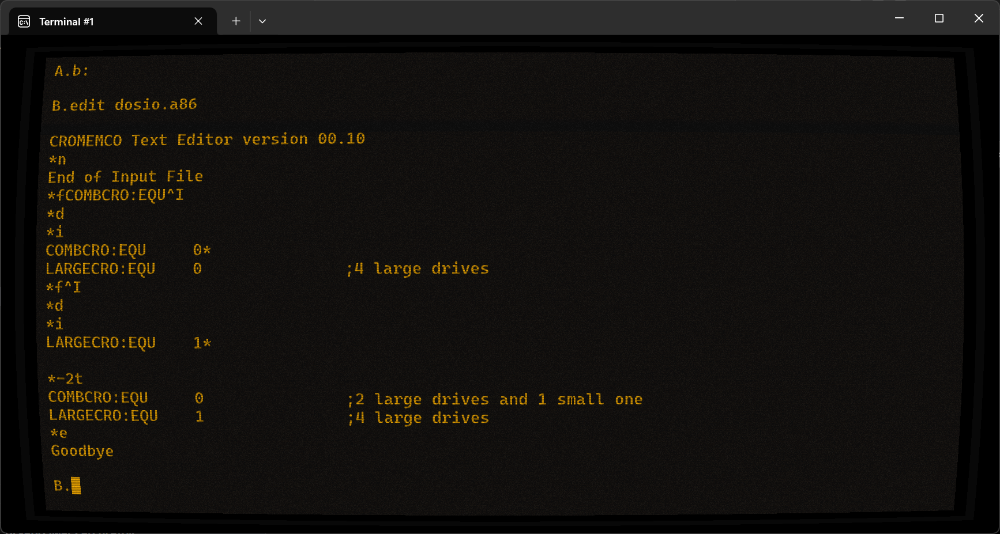

5.  For <code>86DOS</code>, <code>BOOT</code>, <code>COMMAND</code>, <code>DOSIO</code>, <code>HEX2BIN</code> and <code>RDCPM</code>:
    1.  Assemble to .HEX object by running <code>ASM86 \<name\>.BCZ</code>.

    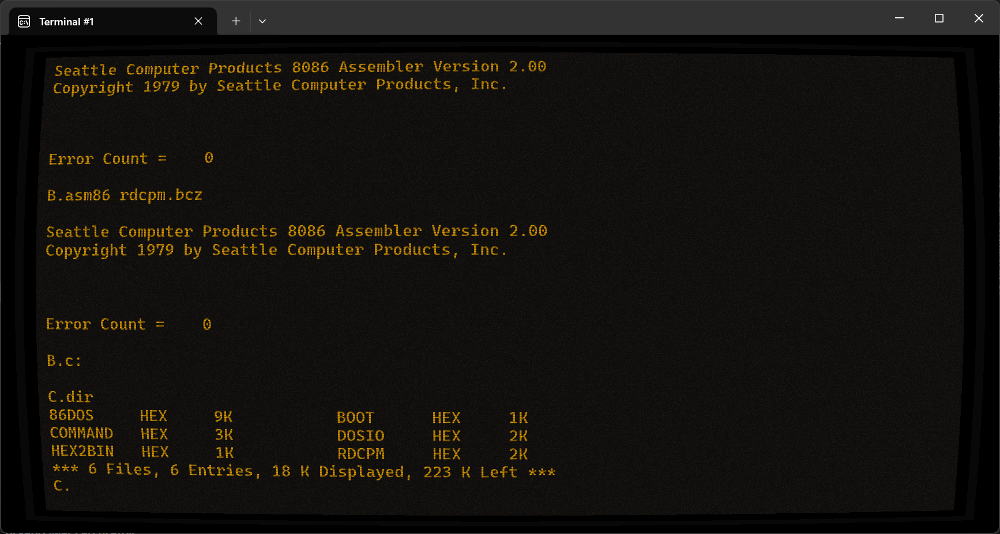

6.  Change to drive C and for <code>86DOS</code>, <code>BOOT</code>, <code>COMMAND</code>, <code>DOSIO</code>, <code>HEX2BIN</code> and <code>RDCPM</code>:
    1.  Load the .HEX object to memory by running <code>DEBUG \<name\>.HEX</code>.

        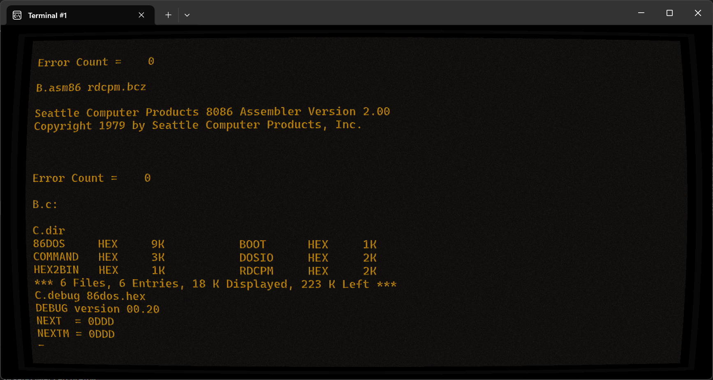

    2. Quit <code>DEBUG</code> and dump the correct number of pages by running <code>SAVE \<name\>.COM \<num-pages\></code>. The number of pages is given by ⌈(<code>NEXT</code> - 0x100) ÷ 0x100⌉.

        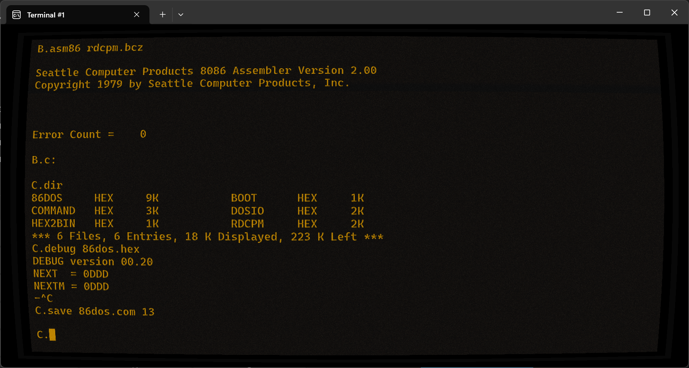

    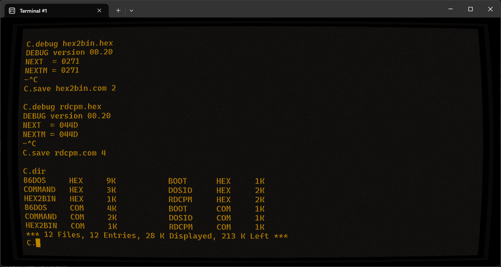

7.  Insert a blank formatted 8" SSSD disk into drive D.
8.  Run <code>DOSGEN D: N</code>.

    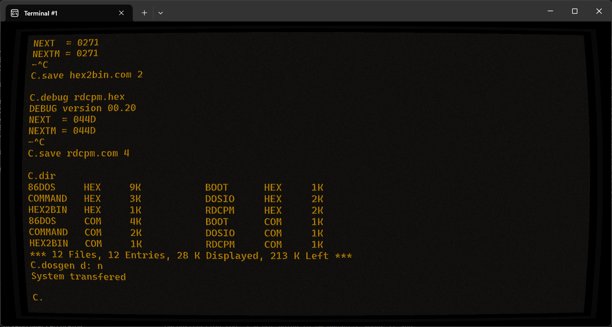

9.  Pop out the disks in drives C and D, and insert them into drives C and A of the S-100 machine, respectively.
10. Boot up the 8086 S-100 machine.

    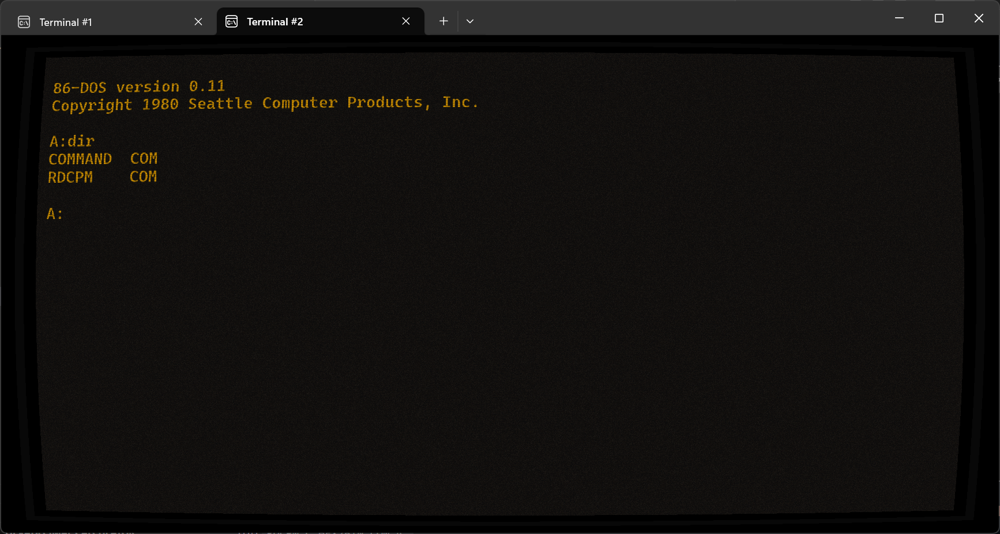

11. Run run <code>RDCPM C:HEX2BIN.COM A:</code> to copy <code>HEX2BIN.COM</code> over.

    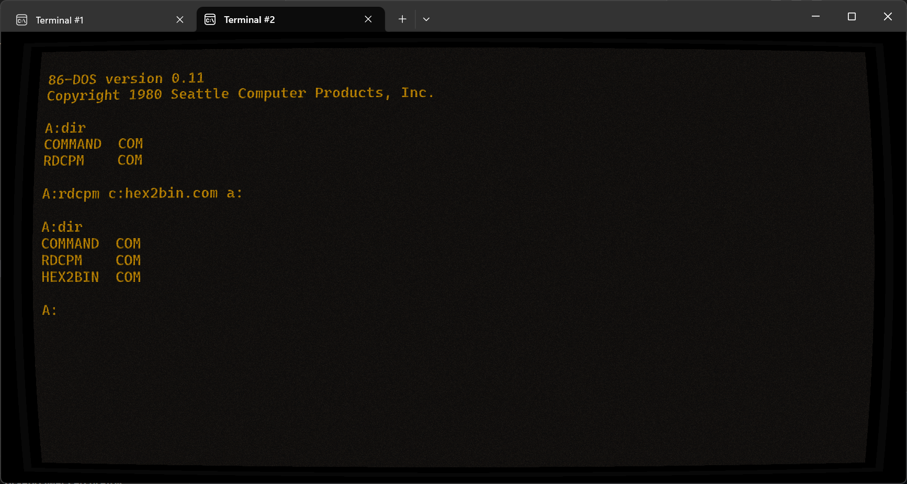

12. The disk in drive A now contains a minimal build of 86-DOS 0.11, which can be used to facilitate the building of a complete copy of 86-DOS 0.11.

## Analysis of Uninitialized Data

### What is Uninitalized Data
SCP's 8086 assembler (hereinafter referred to as ASM86) supports a DS (Define Storage) pseudo-op, similar to MASM's <code>DB n DUP(?)</code>. Since ASM86 generates Intel HEX files, when it encounters a DS, it increments the program counter variable by the specified number of bytes, which, in turn, increases the address in the .HEX file. The same goes for specifying a custom put base, which literally tells the assembler to emit code at a specified address.

When a .HEX file is loaded, the parser reads it line by line and copies the data to the address specified at the beginning of each line. This means that if there is a gap between the addresses of two lines, which would be the case when the put base is incremented by <code>DS</code> or <code>PUT</code>, the data inside the gap will be uninitialized and, therefore, undefined.

Suppose that I originally have this data at address <code>0x100</code>:
```
Offset(h) 00 01 02 03 04 05 06 07 08 09 0A 0B 0C 0D 0E 0F

00000100  54 68 69 73 20 66 69 6C 65 20 63 6F 6E 74 61 69  This file contai
00000110  6E 73 20 6D 79 20 70 61 73 73 77 6F 72 64 2E 20  ns my password. 
00000120  4D 79 20 70 61 73 73 77 6F 72 64 20 69 73 20 61  My password is a
00000130  62 63 31 32 33 2E 20 44 6F 20 6E 6F 74 20 6C 65  bc123. Do not le
00000140  61 6B 20 74 68 69 73 21                          ak this!
```

Now, I load this Intel HEX file (notice the gap of 18 bytes between the second and third line):
```
  Len Addr Type Data                                                 Hash
: 1A  0100 00   2CC3EB8233940FDC4C1C9507C82F8C88237F9602D154EC95F3C6 2F
: 09  011A 00   041CA1DC8862B224C9                                   B6
: 13  0135 00   74CFDA5478D2CCA5C79A6D8BD6CB32629EDE90               F1
```

The memory then becomes this:
```
Offset(h) 00 01 02 03 04 05 06 07 08 09 0A 0B 0C 0D 0E 0F

00000100  2C C3 EB 82 33 94 0F DC 4C 1C 95 07 C8 2F 8C 88  ,Ãë‚3”.ÜL.•.È/Œˆ
00000110  23 7F 96 02 D1 54 EC 95 F3 C6 04 1C A1 DC 88 62  #.–.ÑTì•óÆ..¡Üˆb
00000120  B2 24 C9 70 61 73 73 77 6F 72 64 20 69 73 20 61  ²$Épassword is a
00000130  62 63 31 32 33 74 CF DA 54 78 D2 CC A5 C7 9A 6D  bc123tÏÚTxÒ̥ǚm
00000140  8B D6 CB 32 62 9E DE 90                          ‹ÖË2bžÞ.

```

The 18-byte buffer at offset <code>0x123</code> is what we call uninitialized data, which in this case, happens to contain the leftover string <code>password is abc123</code>.

#### Case Study: CHESS.COM
Let's take a look at this fragment of uninitialized data at offset <code>0x64</code> of <code>CHESS.COM</code>. It's only 156 bytes, but you will be surprised by the amount of information that can be inferred from these bits.

```
Offset(h) 00 01 02 03 04 05 06 07 08 09 0A 0B 0C 0D 0E 0F

00000060              69 6C 65 20 6E 61 6D 65 0D 0A 24 02      ile name..$.
00000070  01 43 48 45 53 53 20 20 20 48 45 58 00 00 B9 03  .CHESS   HEX..¹.
00000080  01 60 E4 0E 66 00 77 00 48 00 11 00 FF FF EB D4  .`ä.f.w.H...ÿÿëÔ
00000090  48 00 50 52 49 4C 53 54 44 4C 20 20 20 00 00 00  H.PRILSTDL   ...
000000A0  09 25 29 00 00 00 00 00 00 00 00 00 00 00 00 00  .%).............
000000B0  00 00 53 55 50 43 48 45 53 53 48 45 58 00 00 00  ..SUPCHESSHEX...
000000C0  47 7E 7F 81 82 83 84 85 86 87 00 00 00 00 00 00  G~..‚ƒ„…†‡......
000000D0  00 00 53 55 50 43 48 45 53 53 43 4F 4D 00 00 00  ..SUPCHESSCOM...
000000E0  32 88 89 8A 8B 8C 8D 8E 00 00 00 00 00 00 00 00  2ˆ‰Š‹Œ.Ž........
000000F0  00 00 44 41 4E 20 20 20 20 20 20 20 20 00 00 00  ..DAN        ...

```

What we first see is a string <code>ile name\r\n$</code>. If we examin <code>RDCPM.COM</code>, we will see that it has the exact same string at offset <code>0x1D5</code>. So, we are probably looking at a partial memory dump of <code>RDCPM</code>. There is a 1-byte size difference between that copy of <code>RDCPM.COM</code> and 86-DOS 0.11's <code>RDCPM.COM</code>, because the string ends at offset <code>0xE</code> of that paragraph instead of <code>0xF</code>. Since we have identified the origin of the data, we can take a look at the <code>RDCPM</code> source code to determine the meaning of the rest of the data.

```x86asm
BADFN:	DB	13,10,"Bad file name",13,10,"$"
DRIVE:	DS	1
DSTFCB:	DS	32
	DB	0
DIRBUF:	DS	128
```
The byte at <code>0x6F</code> is the <code>DRIVE</code> variable, which holds the drive ID of the CP/M disk. A value of <code>0x02</code> signifies drive C. Next comes <code>DSTFCB</code>, the FCB of the destination file. We can see from the first 12 bytes that it's the file <code>A:CHESS.HEX</code>. This gives us the <code>RDCPM</code> command line <code>RDCPM C:CHESS.HEX A:</code>.

If we look further at <code>DSTFCB</code>, we will notice that it does not actually match up with the FCB format of 86-DOS 0.11. This strongly suggests that <code>RDCPM</code> was run under an earlier version of 86-DOS.

After the FCB, we have <code>DIRBUF</code>, which holds a directory sector of the CP/M disk. We can decode it:

| Filename | Size | Blocks | Block List |
| - | - | - | - |
| PRILSTDL | 1152 | 2 | 37, 41 |
| SUPCHESS.HEX | 9088 | 9 | 126, 127, 129, 130, 131, 132, 133, 134, 135 |
| SUPCHESS.COM | 6400 | 7 | 136, 137, 138, 139, 140, 141, 142 |
| DAN | ? | ? | ? |

I have no idea what <code>PRILSTDL</code> was; if I had to guess, it probably had something to do with the printing of assembly language listings. <code>SUPCHESS.HEX</code> had the exact same size as the .HEX file for 86-DOS 0.11's <code>CHESS</code> program, and <code>SUPCHESS.COM</code> had the same size as <code>CHESS.COM</code>, so <code>SUPCHESS</code> thing was just <code>CHESS</code>. I doubt anyone will ever be able figure out what <code>DAN</code> was.

The most crucial information we can infer from this directory fragment is the format of the CP/M disk in drive C. <code>RDCPM</code> only ever supported 2 CP/M disk formats out of the box - the standard 8" SSSD format with a sector skew of 6, and the 5" Cromemco format with a sector skew of 5. The largest block number for the 5" format is about 82, so based on this alone, we can deduce that this directory fragment belonged to an 8" disk.

##### Summary (TL;DR)
1.  The file <code>CHESS.HEX</code> file was converted to <code>CHESS.COM</code> under 86-DOS.
2.  <code>RDCPM</code> was used to copy <code>CHESS.HEX</code> from a CP/M disk.
3.  The <code>RDCPM</code> command was <code>RDCPM C:CHESS.HEX A:</code>.
4.  The disk in drive C was a standard 8" SSSD CP/M disk.
    1.  Given that drive C was 8", the drive configuration was <code>LARGECRO</code>.

#### Case Study: SYS.COM
<code>SYS.COM</code> also has some uninitialized data, this time only a partial directory sector.
```
Offset(h) 00 01 02 03 04 05 06 07 08 09 0A 0B 0C 0D 0E 0F

00000090                             20 41 38 36 00 00 00            A86...
000000A0  2B 4C 4D 5C 68 69 6A 00 00 00 00 00 00 00 00 00  +LM\hij.........
000000B0  00 00 53 59 53 20 20 20 20 20 48 45 58 00 00 00  ..SYS     HEX...
000000C0  04 23 00 00 00 00 00 00 00 00 00 00 00 00 00 00  .#..............
000000D0  00 00 53 59 53 20 20 20 20 20 42 41 4B 00 00 00  ..SYS     BAK...
000000E0  05 26 00 00 00 00 00 00 00 00 00 00 00 00 00 00  .&..............
000000F0  00 00 43 4F 4D 4D 41 4E 44 20 48 45 58 00 00 00  ..COMMAND HEX...
```
| Filename | Size | Blocks | Block List |
| - | - | - | - |
| ?.A86 | 5504 | 6 | 76, 77, 92, 104, 105, 106 |
| SYS.HEX | 512 | 1 | 35 |
| SYS.BAK | 640 | 1 | 38 |
| COMMAND.HEX | ? | ? | ? |

There's nothing particularly interesting here, but <code>SYS.BAK</code> (presumably produced by editing <code>SYS.A86</code> with <code>EDIT</code>) had the exact same size as my reconstructed <code>SYS.A86</code>, so my <code>SYS</code> disassembly can't be too far off the original. I'm not sure what that .A86 file was, but my educated guess is it was <code>COMMAND.A86</code>.

#### File Sizes and RDCPM
The size of files copied off CP/M disks should always be multiples of the block size of the CP/M disk, because <code>RDCPM</code> completely ignores the record count and uses only the block pointers to determine when to stop reading. For instance, if the record size is 1K and the file size is 128, when transferred to a DOS disk with <code>RDCPM</code>, it will be 1024 bytes long.

Since none of the files on the original 86-DOS 0.11 distribution disk are exact multiples of 1K, none of them were directly transferred from CP/M disks. This implies that all the .COM binaries were generated by <code>HEX2BIN</code> from .HEX files copied off CP/M disks. <code>CHESS.DOC</code> was either created from scratch under 86-DOS, or transferred from a CP/M disk and then edited by <code>EDLIN</code> under 86-DOS.
