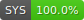

# 86-DOS 0.11 Source Code Reconstruction
Full source code reconstruction of 86-DOS 0.11 - the earliest released version of the earliest operating system for the Intel x86 architecture.

> [!IMPORTANT]
> All 8086 assembly language source files in this repository should use the extension .A86; however, I have chosen to use the extension .ASM instead because GitHub does not detect .A86 files as assembly. To build the source code under CP/M or Cromemco CDOS, you must rename all .ASM files to .A86.

## Progress
          

## Author
This software was written by [@TimPaterson](https://github.com/TimPaterson) in 1980. The reconstructed source code in this repository compiles back to the exact same binaries shipped by Seattle Computer Products. Therefore, it can be fully regrded as Paterson's work.

> [!IMPORTANT]
> Please do not file feature requests or make pull requests to fix bugs in the code. This is not my OS and I want this important piece of digital computing history to be preserved in its most original state. I will not accept anything that alters the assembled binaries in any way, shape or form.

## Disclaimer
This source code reconstruction is a product of reverse engineering. It is important to note that Microsoft Corporation has not released the source code for this specific version of DOS, and its legality may be in a gray area.

The source code reconstruction was undertaken with the understanding that Microsoft Corporation has open-sourced later versions of this operating system under the name MS-DOS, under the MIT License. The intention behind this source code reconstruction project is purely for historical and educational purposes, with a focus on preserving the heritage of early computing.

While efforts have been made to ensure compliance with applicable laws and regulations, the legal status of this source code reconstruction project may not be entirely clear. Users are advised to exercise caution and seek legal advice before using or redistributing any code extracted from this repository.

This project acknowledges the intellectual property rights of Microsoft Corporation and does not seek to infringe upon any proprietary rights. The reconstructed source code is shared in the spirit of historical preservation, education, and appreciation for this wonderful operating system.

By accessing and using the reconstructed source code provided in this repository, you agree to do so at your own risk and assume all responsibility for any legal implications that may arise.

## Building
*See [Building 86-DOS 0.11](./Building.md).*

## Special Thanks
* [@TimPaterson](https://github.com/TimPaterson) - For writing this amazing OS.
* [@geneb](https://github.com/geneb) - For providing a copy of 86-DOS 0.11.
* [@LucasBrooks](https://github.com/LucasBrooks) - For providing an 86-DOS 1.14 kernel disassembly and for documenting the DPB structure.
* [@RichCini](https://github.com/RichCini) - For figuring out some hard-to-decipher logic and for testing and debugging the reconstructed Tarbell-specific code on physical hardware.
